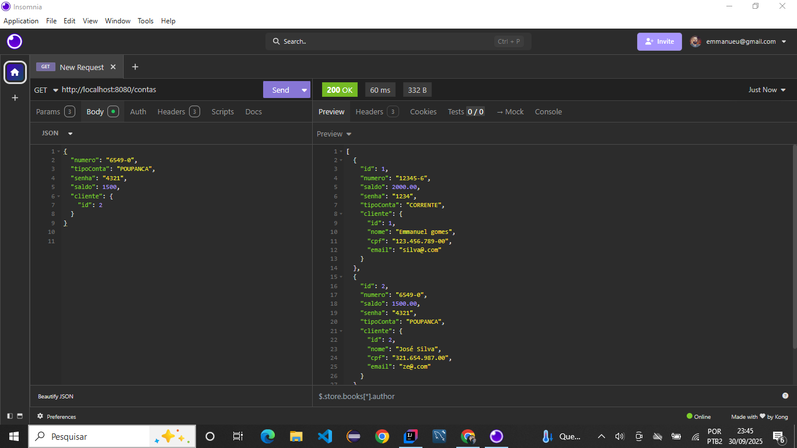
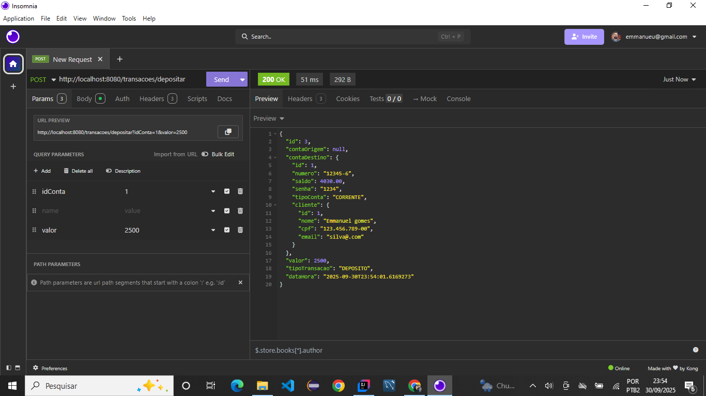
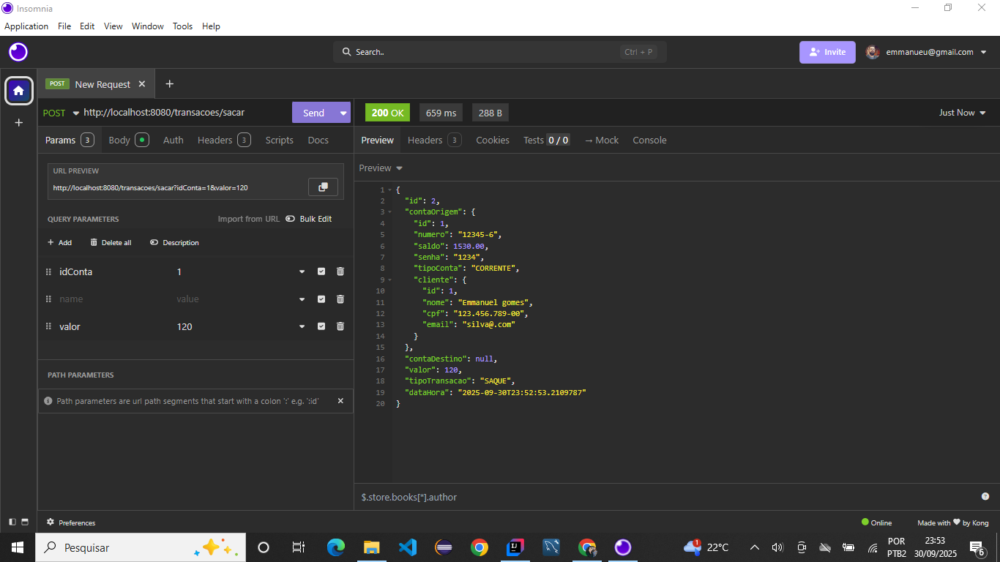
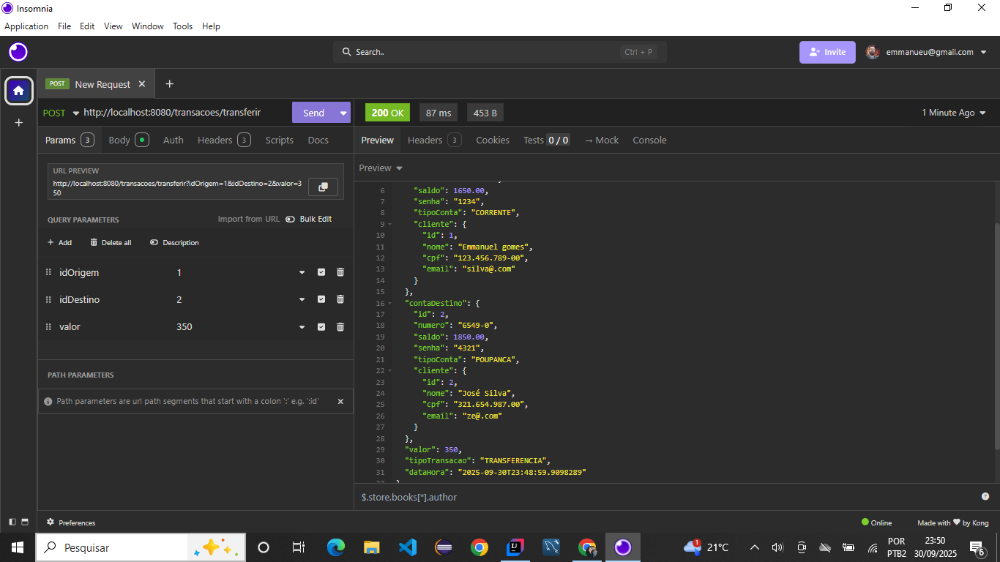

# Mini Banco Digital

CRUD de clientes e gerenciamento de contas e transações para um mini banco digital, feito com Spring Boot, JPA e H2.

## Tecnologias
- Java 21
- Spring Boot (Web, JPA, Validation)
- Lombok
- H2 Database

## 📂 Estrutura do Projeto
- `model` → entidades (Cliente, Conta, Transacao)
- `enums` → tipos de conta e tipos de transação
- `repository` → interfaces JPA
- `service` → regras de negócio
- `controller` → endpoints REST
- `exception` → tratamento global de erros

## Funcionalidades
### Cliente
* Criar cliente (com validação de campos obrigatórios)
* Listar clientes (ordenados pelo nome)
* Atualizar cliente (verifica existência e duplicidade de CPF/email)
* Deletar cliente (verifica existência)

### Conta
* Criar conta vinculada a um cliente
* Listar contas
* Atualizar conta
* Excluir conta

### Transação
* Depositar em conta
* Sacar de conta
* Transferir entre contas
* Registrar data e hora da transação

## ▶️ Endpoints principais
### Cliente
* **POST** `/clientes` → criar cliente
* **GET** `/clientes` → listar clientes
* **PUT** `/clientes` → atualizar cliente
* **DELETE** `/clientes/{id}` → deletar cliente

### Conta
* **POST** `/contas?idCliente={id}` → criar conta vinculada a cliente
* **GET** `/contas` → listar contas
* **PUT** `/contas` → atualizar conta
* **DELETE** `/contas/{id}` → excluir conta

### Transação
* **POST** `/transacoes/depositar?idConta={id}&valor={valor}` → depósito em conta
* **POST** `/transacoes/sacar?idConta={id}&valor={valor}` → saque em conta
* **POST** `/transacoes/transferir?idOrigem={id}&idDestino={id}&valor={valor}` → transferência entre contas

## 📸 Demonstração
### Clientes

### Contas

### Depósito

### Saque

### Transferência

## Como rodar
1. Clonar o repositório
2. Importar no IntelliJ ou Eclipse
3. Rodar a aplicação (`MiniBancoDigitalApplication`)
4. Testar endpoints usando Postman ou Insomnia  
